<div align="center">



</div>

<br/>

<table width="100%">
<tr>
<td width="66%" valign="top">

## A note before the code

I'm a third-year CSE student at **University College of Engineering, Kanchipuram**, spending most of my free time turning half-finished ideas into working web pages. I like the part of development where a design finally *clicks* into place — clean markup, a layout that behaves, a bug that finally makes sense.

Right now I'm deep in **React, Node.js, and Tailwind CSS**, and looking for an internship where I can trade "I think this works" for "I know why this works."

</td>
<td width="34%" valign="top" align="center">

<br/>

`Tamil Nadu, India 🇮🇳`
<br/><br/>
`2023 — 2027`
<br/><br/>
`Open to internships`

</td>
</tr>
</table>

<br/>

<div align="center">


</div>

<br/>

> *"Enthusiastic CSE student driven by curiosity, seeking to apply real‑world skills, grow alongside talented teams, and contribute to products that actually matter."*

<br/>

### — chapter one: where I've been —

```
2023            Higher Secondary, Class XII — Vetri Vidyalaya Higher Secondary School
2023 → 2027     B.E. Computer Science Engineering — UCE Kanchipuram  (in progress)
```

### — chapter two: what I'm building with —

|  |  |  |
|:--|:--|:--|
| **Core** | Python · Java · C | the fundamentals I keep coming back to |
| **Web** | HTML5 · CSS3 · JavaScript | how I actually ship things |
| **Growing into** | React · Node.js · Tailwind | this year's learning arc |
| **Toolbox** | Git · GitHub · VS Code · Figma | daily drivers |

### — chapter three: the numbers —

<div align="center">


</div>

<br/>

### — a running list —

- 🔭 Currently building out my portfolio and a few side projects
- 🌱 Currently learning React, Node.js, and Tailwind CSS
- 🎯 Goal for this year: land a web development internship
- 💬 Happy to talk HTML/CSS, JavaScript, Python, or Git workflows
- 🌑 Fun fact — I debug in dark mode, no exceptions

<br/>

<div align="center">

### Let's talk

<a href="mailto:sanjaipravin@gmail.com">
  
</a>
<a href="https://github.com/devsanjai">
  
</a>
<a href="https://linkedin.com/in/YOUR_LINKEDIN_USERNAME">
  
</a>

<sub>Tamil Nadu, India · last updated August 2026</sub>


</div>
